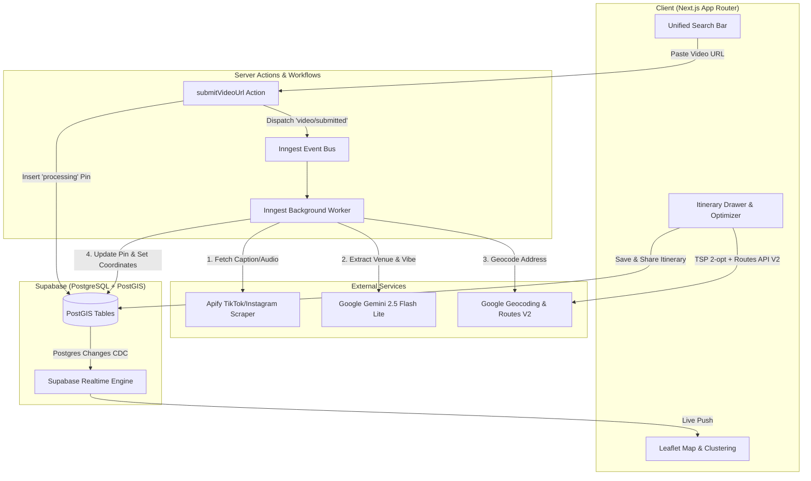

# GeoVibe

> Transform social media videos into interactive geospatial maps and multi-stop travel itineraries.

GeoVibe is a full-stack Next.js application that bridges travel discovery and route execution. It extracts venue names, geographical context, and experiential vibes from TikTok and Instagram reels, geolocates them on an interactive Leaflet map using PostGIS, and orchestrates multi-stop itineraries complete with TSP route optimization and multi-modal routing via Google Routes API V2.

---

## Table of Contents
- [Features](#features)
- [System Architecture](#system-architecture)
- [Tech Stack](#tech-stack)
- [Prerequisites](#prerequisites)
- [Getting Started](#getting-started)
- [Environment Variables](#environment-variables)
- [Database Setup Instructions](#database-setup-instructions)
- [Running the Application](#running-the-application)
- [Core Algorithms & Engineering Highlights](#core-algorithms--engineering-highlights)
- [Project Structure](#project-structure)

---

## Features

### 1. Social Video-to-Map Ingestion
- **Automated Scraping**: Submit TikTok or Instagram URLs; Apify scrapers retrieve captions, author data, and audio transcriptions.
- **LLM Extraction (Gemini 2.5 Flash Lite)**: Extracts exact venue name, locality context (suburb/city), categorization (`Food`, `Drinks`, `Activity`, `Other`), baseline dwell times, and 3 punchy vibe summary bullets.
- **Two-Tier Geocoding**: Google Geocoding API with a fallback to Google Places Text Search. Coordinates are cached in PostGIS to avoid duplicate API calls.
- **Resilient Fallback UX**: If geocoding cannot identify the venue with high confidence, the pin is saved in a `failed` state with a manual location resolver interface.

### 2. Interactive Geospatial Mapping
- **PostGIS Realtime Sync**: Pins are stored as PostGIS `POINT(lng lat)` geometries and broadcasted to clients in real time via Supabase Realtime subscriptions.
- **Leaflet & Marker Clustering**: High-performance interactive map with dynamic clustering, dark/light theme switching, and custom SVG category markers.
- **Manual Venue Search**: Integrated Google Places autocomplete search to manually add spots with custom notes and categories.

### 3. Smart Itinerary Builder & Route Optimization
- **AI-Assisted Curation**: Use natural language prompts (e.g. *"A relaxed afternoon starting with coffee and finishing with craft beer"*) to have Gemini curate and sequence stops from your pin collection.
- **TSP Route Optimization**: Built-in Travelling Salesperson Problem (TSP) solver using **Nearest Neighbour** initialization combined with a **2-opt local search heuristic** to minimize total transit distance.
- **Multi-Modal Route Polyline**: Fetches detailed route geometry and distance/duration matrices via **Google Routes API V2** across `transit`, `walking`, `driving`, and `bicycling`.
- **Dynamic Traveler Pacing**: Adjusts venue dwell times dynamically based on traveler velocity (`fast`: 0.8x, `typical`: 1.0x, `slow`: 1.2x).
- **Public Itinerary Sharing**: Generate vanity slugs (`/shared/[slug]`) to share interactive, view-only itineraries with OpenGraph previews.

---

## System Architecture



---

## Tech Stack

| Layer | Technology | Purpose |
|---|---|---|
| **Framework** | [Next.js 16](https://nextjs.org/) (App Router, Server Actions) | React full-stack framework with SSR and streaming |
| **Frontend** | React 19, TypeScript, Tailwind CSS v4, Framer Motion | UI components, fluid animations, and styling |
| **Maps & Geo** | [Leaflet](https://leafletjs.com/), `react-leaflet`, `react-leaflet-cluster` | Interactive mapping, marker clustering, and polyline rendering |
| **Database** | [Supabase](https://supabase.com/) (PostgreSQL + PostGIS) | Geospatial storage, Row Level Security, and Realtime CDC |
| **Background Jobs** | [Inngest](https://www.inngest.com/) | Durable execution engine for scraping, AI parsing, and geocoding |
| **AI / LLM** | [Google Gemini 2.5 Flash Lite](https://ai.google.dev/) | Structured JSON extraction for venue details and itinerary sequencing |
| **Scraping** | [Apify](https://apify.com/) (`tiktok-scraper`, `instagram-scraper`) | TikTok/Instagram post metadata and transcript extraction |
| **Routing & Geocoding** | [Google Maps Platform](https://developers.google.com/maps) | Geocoding API, Places API (Text Search), Routes API V2 |

---

## Prerequisites

Ensure you have the following installed on your local machine:
- **Node.js**: `v20.x` or higher
- **npm** or **pnpm**
- **Supabase Account**: With a new or existing project
- **Google Cloud Platform Project**: With Geocoding API, Places API (New), and Routes API enabled
- **Google AI Studio Key**: For Gemini 2.5 Flash Lite access
- **Apify Account** *(optional)*: For live Instagram/TikTok video scraping (mock fallbacks are provided if omitted)

---

## Getting Started

### 1. Clone the repository
```bash
git clone https://github.com/pangwuu/GeoBeige.git
cd GeoBeige
```

### 2. Install dependencies
```bash
npm install
```

### 3. Configure environment variables
Create a `.env.local` file by copying the provided `.env.example`:
```bash
cp .env.example .env.local
```
Fill in the credentials as outlined in the [Environment Variables](#environment-variables) section below.

---

## Environment Variables

| Variable | Description | Where to Obtain |
|---|---|---|
| `NEXT_PUBLIC_SUPABASE_URL` | Supabase Project URL | Supabase Dashboard $\rightarrow$ Project Settings $\rightarrow$ API |
| `NEXT_PUBLIC_SUPABASE_ANON_KEY` | Supabase Anonymous Client Key | Supabase Dashboard $\rightarrow$ Project Settings $\rightarrow$ API |
| `SUPABASE_SERVICE_ROLE_KEY` | Supabase Service Role Secret (bypasses RLS in Inngest background jobs) | Supabase Dashboard $\rightarrow$ Project Settings $\rightarrow$ API |
| `GEMINI_API_KEY` | API Key for Google Gemini 2.5 Flash Lite | [Google AI Studio](https://aistudio.google.com/) |
| `GOOGLE_MAPS_API_KEY` | Google Maps API key (Geocoding, Places New, Routes V2) | [Google Cloud Console](https://console.cloud.google.com/google/maps-apis) |
| `APIFY_API_TOKEN` | Apify API token for running scrapers | [Apify Console](https://console.apify.com/account/integrations) |
| `NEXT_PUBLIC_SITE_URL` | Base application URL for auth redirects (default: `http://localhost:3000`) | Set to your production domain or leave default for local development |

---

## Database Setup Instructions

The application requires PostgreSQL with the **PostGIS** extension enabled, along with specific tables, constraints, and Row Level Security (RLS) policies.

### Step-by-Step Setup

1. Open your project in the [Supabase Dashboard](https://supabase.com/dashboard).
2. In the left navigation, click on **SQL Editor**.
3. Click **New Query**, paste the complete SQL script below (or load [`supabase/schema.sql`](supabase/schema.sql)), and click **Run**.

<details>
<summary><strong>Click to view the complete Supabase SQL Setup Script</strong></summary>

```sql
-- 1. Enable PostGIS Extension
CREATE EXTENSION IF NOT EXISTS postgis;

-- 2. Pins Table
CREATE TABLE IF NOT EXISTS public.pins (
  id UUID PRIMARY KEY DEFAULT gen_random_uuid(),
  user_id UUID REFERENCES auth.users(id) ON DELETE SET NULL,
  venue_name TEXT NOT NULL,
  city TEXT,
  summary TEXT,
  category TEXT NOT NULL CHECK (category IN ('Food', 'Drinks', 'Activity', 'Other')) DEFAULT 'Other',
  suggested_dwell_time INTEGER NOT NULL DEFAULT 60,
  source_url TEXT,
  location GEOMETRY(Point, 4326) DEFAULT ST_SetSRID(ST_MakePoint(0, 0), 4326),
  status TEXT NOT NULL CHECK (status IN ('processing', 'completed', 'failed')) DEFAULT 'processing',
  created_at TIMESTAMPTZ NOT NULL DEFAULT now(),
  updated_at TIMESTAMPTZ NOT NULL DEFAULT now()
);

-- Indexes for pins
CREATE INDEX IF NOT EXISTS pins_location_idx ON public.pins USING GIST(location);
CREATE INDEX IF NOT EXISTS pins_user_id_idx ON public.pins(user_id);
CREATE INDEX IF NOT EXISTS pins_source_url_idx ON public.pins(source_url);
CREATE INDEX IF NOT EXISTS pins_status_idx ON public.pins(status);

-- 3. Itineraries Table
CREATE TABLE IF NOT EXISTS public.itineraries (
  id UUID PRIMARY KEY DEFAULT gen_random_uuid(),
  created_by UUID NOT NULL REFERENCES auth.users(id) ON DELETE CASCADE,
  title TEXT NOT NULL,
  description TEXT,
  traveller_type TEXT NOT NULL CHECK (traveller_type IN ('fast', 'typical', 'slow')) DEFAULT 'typical',
  is_public BOOLEAN NOT NULL DEFAULT false,
  share_slug TEXT UNIQUE,
  created_at TIMESTAMPTZ NOT NULL DEFAULT now(),
  updated_at TIMESTAMPTZ NOT NULL DEFAULT now()
);

CREATE INDEX IF NOT EXISTS itineraries_created_by_idx ON public.itineraries(created_by);
CREATE INDEX IF NOT EXISTS itineraries_share_slug_idx ON public.itineraries(share_slug);

-- 4. Itinerary Stops Table
CREATE TABLE IF NOT EXISTS public.itinerary_stops (
  id UUID PRIMARY KEY DEFAULT gen_random_uuid(),
  itinerary_id UUID NOT NULL REFERENCES public.itineraries(id) ON DELETE CASCADE,
  pin_id UUID NOT NULL REFERENCES public.pins(id) ON DELETE CASCADE,
  stop_order INTEGER NOT NULL,
  dwell_time_minutes INTEGER NOT NULL DEFAULT 60,
  notes TEXT,
  created_at TIMESTAMPTZ NOT NULL DEFAULT now()
);

CREATE INDEX IF NOT EXISTS itinerary_stops_itinerary_id_idx ON public.itinerary_stops(itinerary_id);
CREATE INDEX IF NOT EXISTS itinerary_stops_pin_id_idx ON public.itinerary_stops(pin_id);

-- 5. Itinerary Legs (Routes) Table
CREATE TABLE IF NOT EXISTS public.itinerary_legs (
  id UUID PRIMARY KEY DEFAULT gen_random_uuid(),
  itinerary_id UUID NOT NULL REFERENCES public.itineraries(id) ON DELETE CASCADE,
  from_stop_id UUID NOT NULL REFERENCES public.itinerary_stops(id) ON DELETE CASCADE,
  to_stop_id UUID NOT NULL REFERENCES public.itinerary_stops(id) ON DELETE CASCADE,
  transport_mode TEXT NOT NULL CHECK (transport_mode IN ('walking', 'driving', 'transit', 'bicycling')) DEFAULT 'transit',
  duration_seconds INTEGER NOT NULL,
  distance_meters INTEGER NOT NULL,
  polyline TEXT NOT NULL,
  created_at TIMESTAMPTZ NOT NULL DEFAULT now()
);

CREATE INDEX IF NOT EXISTS itinerary_legs_itinerary_id_idx ON public.itinerary_legs(itinerary_id);

-- 6. Enable Realtime Replication for Pins Table
ALTER PUBLICATION supabase_realtime ADD TABLE public.pins;

-- 7. Row Level Security (RLS) Policies
ALTER TABLE public.pins ENABLE ROW LEVEL SECURITY;
ALTER TABLE public.itineraries ENABLE ROW LEVEL SECURITY;
ALTER TABLE public.itinerary_stops ENABLE ROW LEVEL SECURITY;
ALTER TABLE public.itinerary_legs ENABLE ROW LEVEL SECURITY;

-- Pins Policies
CREATE POLICY "Pins are viewable by everyone" 
  ON public.pins FOR SELECT 
  USING (true);

CREATE POLICY "Users can insert their own pins" 
  ON public.pins FOR INSERT 
  TO authenticated 
  WITH CHECK (auth.uid() = user_id);

CREATE POLICY "Users can update their own pins" 
  ON public.pins FOR UPDATE 
  TO authenticated 
  USING (auth.uid() = user_id);

CREATE POLICY "Users can delete their own pins" 
  ON public.pins FOR DELETE 
  TO authenticated 
  USING (auth.uid() = user_id);

-- Itineraries Policies
CREATE POLICY "Users can view own or public itineraries" 
  ON public.itineraries FOR SELECT 
  USING (auth.uid() = created_by OR is_public = true);

CREATE POLICY "Users can insert their own itineraries" 
  ON public.itineraries FOR INSERT 
  TO authenticated 
  WITH CHECK (auth.uid() = created_by);

CREATE POLICY "Users can update their own itineraries" 
  ON public.itineraries FOR UPDATE 
  TO authenticated 
  USING (auth.uid() = created_by);

CREATE POLICY "Users can delete their own itineraries" 
  ON public.itineraries FOR DELETE 
  TO authenticated 
  USING (auth.uid() = created_by);

-- Stops Policies
CREATE POLICY "Stops are viewable if itinerary is viewable" 
  ON public.itinerary_stops FOR SELECT 
  USING (
    EXISTS (
      SELECT 1 FROM public.itineraries 
      WHERE itineraries.id = itinerary_stops.itinerary_id 
        AND (itineraries.created_by = auth.uid() OR itineraries.is_public = true)
    )
  );

CREATE POLICY "Users can manage stops for their own itineraries" 
  ON public.itinerary_stops FOR ALL 
  TO authenticated 
  USING (
    EXISTS (
      SELECT 1 FROM public.itineraries 
      WHERE itineraries.id = itinerary_stops.itinerary_id 
        AND itineraries.created_by = auth.uid()
    )
  );

-- Legs Policies
CREATE POLICY "Legs are viewable if itinerary is viewable" 
  ON public.itinerary_legs FOR SELECT 
  USING (
    EXISTS (
      SELECT 1 FROM public.itineraries 
      WHERE itineraries.id = itinerary_legs.itinerary_id 
        AND (itineraries.created_by = auth.uid() OR itineraries.is_public = true)
    )
  );

CREATE POLICY "Users can manage legs for their own itineraries" 
  ON public.itinerary_legs FOR ALL 
  TO authenticated 
  USING (
    EXISTS (
      SELECT 1 FROM public.itineraries 
      WHERE itineraries.id = itinerary_legs.itinerary_id 
        AND itineraries.created_by = auth.uid()
    )
  );
```
</details>

4. In **Authentication $\rightarrow$ URL Configuration**:
   - Set **Site URL** to `http://localhost:3000`
   - Add `http://localhost:3000/auth/callback` to **Redirect URLs**.

---

## Running the Application

To run GeoVibe locally with full background job execution, you will run two processes: the Next.js development server and the Inngest local development server.

### Terminal 1: Next.js Web App
```bash
npm run dev
```
The application will be accessible at [http://localhost:3000](http://localhost:3000).

### Terminal 2: Inngest Dev Server
```bash
npm run inngest:dev
```
The Inngest local dev dashboard will be accessible at [http://localhost:8288](http://localhost:8288). It automatically binds to your local Next.js API route (`http://localhost:3000/api/inngest`) to execute and debug background functions with step-by-step visibility.

---

## Core Algorithms & Engineering Highlights

### 1. Traveling Salesperson Problem (TSP) Optimization
When planning an itinerary with up to 8 stops, visiting them in random order creates inefficient zig-zagging routes. GeoVibe implements a dual-heuristic optimization pipeline directly in TypeScript ([`app/actions/itineraries.ts`](app/actions/itineraries.ts)):
1. **Nearest Neighbour Initialization ($O(n^2)$)**: Starts at the user's first chosen stop and greedily selects the closest unvisited stop using great-circle Haversine distance.
2. **2-opt Local Search ($O(n^2)$ per pass)**: Iteratively evaluates pairs of route edges, swapping and reversing sub-paths if the swap reduces total distance, eliminating route intersections until local optimality is reached.

This runs instantaneously on the server without consuming external routing API quotas during the ordering stage.

### 2. Google Routes API V2 Integration
Once stops are ordered, GeoVibe calls Google Routes API V2 ([`lib/google/directions.ts`](lib/google/directions.ts)) using strict field masking (`X-Goog-FieldMask: routes.duration,routes.distanceMeters,routes.polyline.encodedPolyline`). This reduces response payloads by $>80\%$ and generates encoded polylines rendered seamlessly on the Leaflet canvas.

### 3. Resilient Ingestion Workflow with Inngest
Social media scraping and LLM processing are inherently non-deterministic. GeoVibe leverages Inngest step functions ([`lib/inngest/functions.ts`](lib/inngest/functions.ts)):
- **Step 1: Scrape Video**: Fetches captions/transcriptions via Apify (or falls back to mock payload if tokens are unset).
- **Step 2: AI Extraction**: Enforces JSON Schema mode on Gemini 2.5 Flash Lite.
- **Step 3: Geocoding with Local Cache**: Checks if the venue has already been resolved in PostGIS before calling external Google Maps APIs.
- **Step 4: Atomic DB Upsert**: Updates the placeholder pin from `processing` to `completed` (or `failed` if unresolved), triggering instant UI updates via Postgres CDC to Leaflet.

---

## Project Structure

```
GeoBeige/
├── app/
│   ├── actions/               # Server Actions (Auth, Pins, Itineraries, Manual Search)
│   │   ├── auth.ts            # Supabase auth handlers & user metadata
│   │   ├── itineraries.ts     # Route generation, 2-opt TSP, itinerary persistence
│   │   ├── manualPins.ts      # Google Places text search & pin creation
│   │   └── pins.ts            # Video submission & Inngest event dispatch
│   ├── api/
│   │   └── inngest/route.ts   # Inngest webhook route endpoint
│   ├── auth/confirm/route.ts  # Email confirmation callback
│   ├── shared/[slug]/         # Public read-only shared itinerary page
│   ├── layout.tsx             # Root layout & theme initialization
│   └── page.tsx               # Primary interactive map & itinerary UI
├── components/
│   ├── auth/AuthModal.tsx     # Supabase authentication modal
│   ├── forms/UnifiedSearchBar # URL submission & manual venue search bar
│   ├── map/
│   │   ├── ItineraryDrawer.tsx# Multi-stop planner, reordering, route viewer
│   │   ├── LeafletMap.tsx     # Dynamic Leaflet map, clustering, polylines
│   │   └── ShareModal.tsx     # Shareable link generator modal
│   └── ui/                    # Glassmorphism cards, buttons, badges
├── lib/
│   ├── ai/gemini.ts           # Gemini 2.5 Flash Lite prompt engineering
│   ├── geocoding/index.ts     # Google Geocoding & Places search fallback
│   ├── google/directions.ts   # Google Routes API V2 client
│   ├── inngest/
│   │   ├── client.ts          # Inngest SDK client configuration
│   │   └── functions.ts       # Video ingestion multi-step durable workflow
│   ├── supabase/              # Browser & SSR Supabase clients
│   └── utils/
│       ├── formatters.ts      # Distance and duration humanizers
│       └── postgis.ts         # EWKB and WKB geometry parser
├── supabase/
│   └── schema.sql             # Complete PostGIS DDL, indexes, and RLS policies
├── .env.example               # Template for environment configuration
└── package.json
```

---

## License
This project is licensed under the ISC License.
